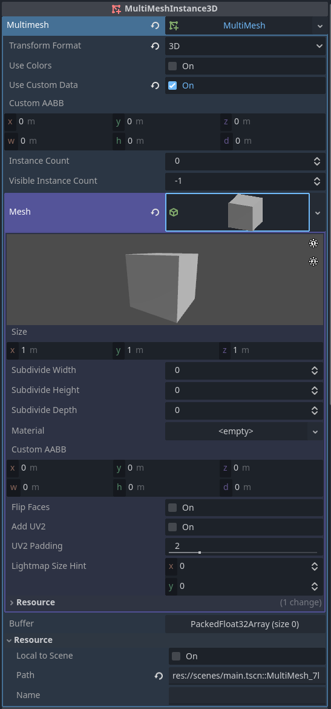

# Simple 3D Map

## Introduction

This project goal is to demonstrate and experiment mesh instancing to display a heightmap in 3D.To this end, we will use the [Godot Engine](https://github.com/godotengine/godot).

## Principle

The heightmap is a 2D raster. Each cell represents a height value. To represent this map in 3D, we will use a box or each cells. The box will be stretched to match the height of the associated cell. Depending on the map size, it can represent a lot of boxes !
Worry not ! Enters mesh instancing !
We will ask the GPU to render a set of boxes with their own transformations and attributes, all at once.

## Scene

For this demonstration, we only need one simple scene consisting in a mesh, a camera and a couple of lights.


### Mesh

Mesh instancing in Godot is done using the [MultiMeshInstance3D](https://docs.godotengine.org/en/stable/tutorials/3d/using_multi_mesh_instance.html) node. We simply set a box as base mesh, set the transformation as 3D and activate the use of custom data (we'll need them to do funny stuff with shaders).



### Camera

The camera is using the [Camera3D](https://docs.godotengine.org/en/stable/classes/class_camera3d.html) node. Placement is not essential as it will be computed using the scene script (see below).

### Lights

The lights are simple [DirectionalLight3D](https://docs.godotengine.org/en/stable/classes/class_directionallight3d.html).

## Script

Camera control, heightmap computation and mesh instance management is done using one simple script (in GDScript). It could have been more clean to split it by intent, but as it is relatively small, one could have a glimpse of the whole process at once.

### Camera control

The camera is a simple semi-orbiting cam around the map center with the following controls :
- Left button drag X : turn around the map center
- Left button drag Y : change elevation
- Mouse wheel : change distance to the center

The controls set the desired camera position, and the script process (see ```_process``` function) just gently make a smooth transition from the current position and the desired one.

### Map generation

To generate the heightmap, we simply use a continuous noise function. Each time the ENTER key is stroke, a new seed is set and a new heightmap is generated. With the generation goes the mesh instance computation. We will determine how many instance we need but more importantly, what are the transformations and additional data for each of them.
The transformations are simple. We just translate each box instance according to their position in the map (center around (0, 0) for convenience). We leave the height/scale on Y management to the shader. For this, we set the custom data (using ```MultiMesh::set_instance_custom_data```) as follow:
- **X** : Normalized distance from the center (in [0, 1]).
- **Y** : Previous map cell height.
- **Z** : Current map cell height.

## Shader

The [shader](resources/shaders/map.gdshader) controls the cell height (as the position on XZ plane is already set using the instance transformation). To illustrate the use of custom data, it will also control the transition between previous and current map. This transition is pictured as a wave that starts from the center and spread to the corners, replacing old height values by new ones.

The shader takes four parameters (common to all instances) :
- **height** : A height used for map transition. For a better rendering, it is set to the current map maximum height.
- **progress** : Controls the transition. Ranges from 0 to 1. At 0, the previous map is rendered, at 1, the current old map is rendered.
- **band** : The size of the update wave, ranging from 0 to 1.
- **distance_smooth** : As the update goes, the height transitions from old value to ```height``` and back to current value. However, as the cells are distant from the center, the transition should/could be smoother. This aspect is controlled by this value. At 0, the transition passes through ```height```, but at 1, it simply goes from old to current value.
